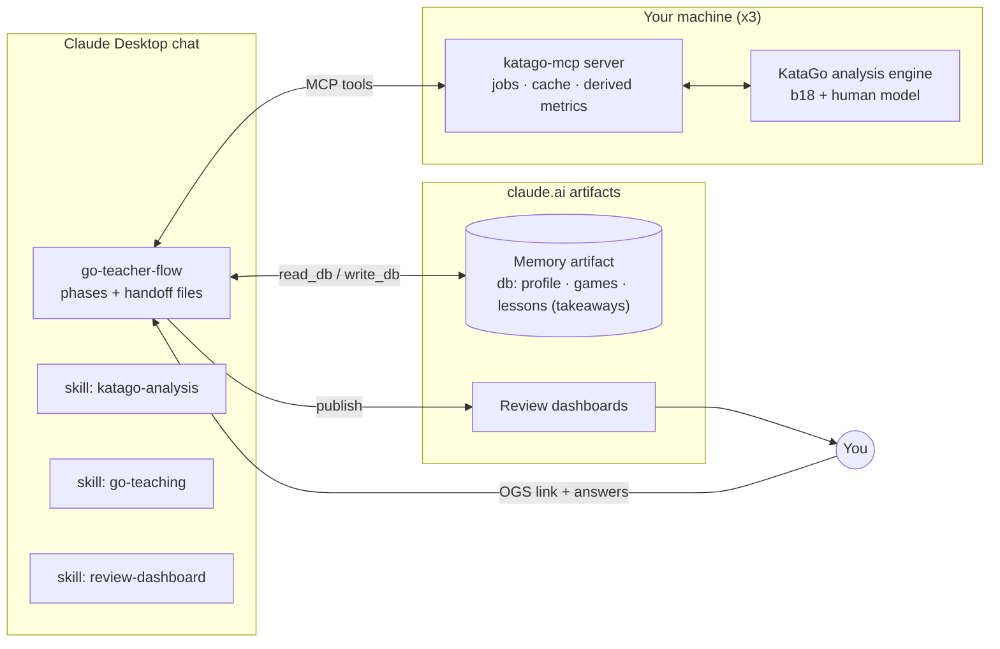

# Go Teacher — Build Plan

**Status:** built through WS7; WS10 (the teacher-pattern redesign, 4 Oct) replaces the time budget, the
taxonomy and WS8; WS9 not started (§3). The details live where they are used: the tool contract in
`skills/go-teacher-flow/references/tool-contract.md`, the teaching method in `skills/go-teaching`, the
tool recipes in `skills/katago-analysis`, the review steps in `skills/go-teacher-flow`, the memory
schema in `skills/go-teacher-flow/references/memory.md`. This file
keeps the goal, the workstreams' acceptance bars, status, decisions and risks.
**Effort sizes:** S = an evening · M = a weekend · L = one to two weeks part-time · XL = more than that.

---

## 0. Goal, scope, principles

### Goal
A Claude project that reviews your OGS games the way a strong, patient teacher would, so that you understand the mistakes you make and how to improve from there: a quick pass over the whole game for its story, then the key moments one at a time — what you were thinking, what actually happens (KataGo is the authority on that), back and forth until you understand — and at the end of each moment you can say exactly what you will do differently next time. The review ends on an interactive page that also shows the engine's best move at every move, and a memory of your takeaways notices when the same thing keeps coming back.

### In scope (v1)
- 19×19 games from OGS, Japanese rules, even and handicap, either color. You are `cwhay888`, currently 6–7k.
- Three machines: Windows + AMD 5700XT, M2 MacBook Air, M5 MacBook Pro.
- Asynchronous first pass running during the student's guided self-review; key moments prepared in the background while the story is told.
- One published dashboard per review; a cloud database of past takeaways shared across machines.

### Out of scope (v1)
- Progress tracking over time (you do this elsewhere).
- Live analysis while playing; a playing bot.
- 9×9 and 13×13 (cheap later: KataGo supports them; the renderer needs a size parameter).
- Opponent analysis beyond what is needed to detect missed punishments and to explain the result honestly.

### Principles every workstream serves
1. **The engine is the authority on the board.** Claude brings the story, the questions, the ideas that make a position understandable and the patience to go back and forth; every concrete claim (a sequence, a status, a count) comes from a tool result.
2. **Review like a teacher.** A quick pass for the story of the game, then the key moments; Claude decides which and how many as the review goes (decision 21).
3. **Self-review first, then check the reasoning.** The student reviews the game themselves first — surprises, shifts, successes and their own reasoning — before any engine result; the engine then checks their reasoning, not just their moves, and at each key moment they say what they were thinking before anything is shown (decision 23).
4. **Explanation by lines, not labels.** The student's thinking first, then what actually happens, shown as engine-checked lines on the page; the *why* is what differs at the ends of the lines. A score difference is the size of a mistake, never its reason. No taxonomy (decision 20).
5. **One to three takeaways per game, ideally one**, each a change in how the student thinks, said and written in their own words, concrete enough to check at the board.
6. **Engine-validated dashboard.** No sequence appears in the dashboard unless the server has legality-checked and evaluated it.
7. **Points, not percentages.** Score lead is the unit for everything; winrate only answers "how decided is the game."
8. **Simplest sufficient move.** When the engine's best move is hard to find at the student's rank, recommend the move within about a point of it that a player three stones stronger plays most often.
9. **Server computes, Claude narrates.** Derived facts (chains, group fates, swings, decisive moment, end comparisons) are computed deterministically in the server so they are consistent across reviews and machines and cannot be confabulated.
10. **As long as it needs.** No time budget: search sizes are fixed per machine, a review aims at about 30 minutes, and goes longer when the student wants (decision 19).

---

## 1. Components

| # | Component | Where it runs | Form | Size |
|---|---|---|---|---|
| C1 | KataGo + networks | each machine | binary, two networks, per-machine config | M |
| C2 | `katago-mcp` server | each machine | Python MCP server | XL |
| C3 | Skill `katago-analysis` | Claude (user skill) | SKILL.md | M |
| C4 | Skill `go-teaching` | Claude (user skill) | SKILL.md | M |
| C5 | Skill `review-dashboard` | Claude (user skill) | SKILL.md + HTML template + build script | L |
| C6 | Review flow | Claude project instructions, or the `go-teacher-flow` skill in a plain Claude Desktop chat | phases + handoff files | M |
| C7 | Memory artifact | claude.ai (published page with `db`) | artifact + schema | M |
| C8 | Review dashboards | claude.ai (published pages) | generated per review | part of C5 |
| C9 | Seed corpus + calibration | one-time | retired with the taxonomy (WS10) | — |



The steps of one review are in `skills/go-teacher-flow/SKILL.md`.

**Repository layout** (as built)
```
Go-Teacher/
  katago-mcp/          katago_mcp/ (the server), config/{analysis.cfg,m5pro,r5700xt,m2air}.toml,
                       install/, scripts/, tests/
  skills/
    katago-analysis/   SKILL.md
    go-teaching/       SKILL.md
    review-dashboard/  SKILL.md, references/dashboard-input.md, template/dashboard.html, scripts/build_dashboard.py
    go-teacher-flow/   SKILL.md, references/{memory.md, tool-contract.md}
  docs/                plan.md, archive/ (finished plans)
  seed/                local only (not in git): seed SGFs and calibration notes of the taxonomy design
```

---

## 2. Workstreams

### WS1 — Engine setup on three machines (C1) — Size M
A working `katago analysis` process on each machine with correct rules handling and a recorded, sustained
throughput. Install and benchmark steps: `katago-mcp/README.md` §2.

**Acceptance**
- A JSON query to `katago analysis` returns on all three machines.
- Visits/s recorded per machine (cold and sustained).
- Result reconciliation passes on 3/3 counted games (even and handicap).

**Dependencies:** none.

### WS2 — `katago-mcp` server (C2) — Size XL
The one component that touches the engine: a teaching-oriented tool surface, asynchronous survey jobs,
budget conversion, caching, deterministic derived facts, and validation of everything that reaches the
dashboard. Python with the official MCP SDK; its own SGF parser and board; `unittest` suite against a
mock engine. Tools, inputs, outputs, derived metrics and the budget algorithm:
`skills/go-teacher-flow/references/tool-contract.md`.

**Acceptance**
- All tools callable from the Claude desktop app on the Pro; a 250-move survey finishes within `survey_minutes_target` (10 min) on the Pro.
- `engine_info` estimates how long `explain_moment` takes on each machine, within 30 % of the measured time.
- On a game you know well, the story's key moments include your own view of the biggest mistakes at least two of three times (a sanity check, not precision).
- `validate_variations` rejects an illegal or misordered branch.
- Golden tests pass; logs and `analysis.json` written.

**Dependencies:** WS1.

### WS3 — Skill `katago-analysis` (C3) — Size M
How to use the tools and read their output: the story, `explain_moment`, the follow-up tools, what
keeps explanations honest. See `skills/katago-analysis/SKILL.md`. (Rewritten in WS10.)

**Acceptance.** A dry run in which Claude, given a story and `explain_moment` results and no other help, explains three key moments with every claim traceable to a query id.

**Dependencies:** WS2 tool contract.

### WS4 — Skill `go-teaching` (C4) — Size M
The pedagogy: the guided self-review, checking the student's reasoning with the story, choosing key moments,
asking first, the explanation standard, the back and forth, the takeaway, recall quizzes, conduct. See
`skills/go-teaching/SKILL.md`. (Rewritten in WS10.)

**Acceptance.** A sample explanation written from real `explain_moment` results passes a checklist: starts from the student's thinking, every claim traceable, every sequence on the page, the why from the end comparison, no uncashed concept words.

**Dependencies:** WS3 (`explain_moment`).

### WS5 — Skill `review-dashboard` + build script (C5, C8) — Size L
A fixed, tested HTML template that renders any review from a JSON data file, so Claude produces data,
never code. `validate_variations` assembles the blob (contract §1.17, §5); `build_dashboard.py` checks
its SHA-256. See `skills/review-dashboard/SKILL.md`. Deferred to v1.1: live click evaluation via the
artifact `mcp` capability, an "ask the teacher" panel, SGF export.

**Acceptance.** A dashboard built from the test data works on desktop and phone; a dashboard built from a real review contains zero hand-written HTML.

**Dependencies:** WS2 (`validate_variations`).

### WS6 — Memory artifact (C7) — Size M
The student's takeaways across games and the themes that recur, shared across all three machines, in the
"Go teacher memory" artifact's `db`. Collections, the read at the start and the write recipe:
`skills/go-teacher-flow/references/memory.md`. (Recurrence by takeaway theme since WS10; the lessons of
earlier reviews carry over as takeaways.)

**Acceptance.** Two consecutive reviews where the second one visibly uses the first one's takeaways (a recall quiz on one; a repeated theme named when it comes back).

**Dependencies:** WS4 (taxonomy and beliefs).

### WS7 — Review flow (C6) — Size M
The orchestrator: the steps of a review, the notes files, what to do when things go wrong. See
`skills/go-teacher-flow/SKILL.md` (it also serves plain Claude Desktop chats, the only chats that reach
the local server). (Rewritten in WS10.)

**Acceptance.** One full review on the Pro where every key moment ends in a takeaway in the student's words and each claim traces to a logged query.

**Dependencies:** WS3, WS4, WS5, WS6.

### WS8 — Seeding and calibration (C9) — retired
The taxonomy's calibration (tag accuracy, belief thresholds, seeding memory with survey-grade episodes).
Retired by WS10 with the taxonomy; the seed survey's lessons stay in memory as takeaways.

### WS9 — Integration, hardening, remaining machines — Size M
End-to-end reviews on three games (even as Black, even as White, handicap); the server on the 5700XT and
the Air; a 10-item review-quality rubric for the first 5–10 reviews; failure drills (engine down
mid-job, Air timeout with partial results, SGF with passes and a resign, wrong komi); versions recorded
so you know which skills and server produced which review.

**Acceptance.** Three reviews score ≥ 8/10 on the rubric; all three machines work, and on the Air `engine_info` estimates `explain_moment` within 30 %.

### WS10 — Teacher-pattern redesign — Size L — built 4 Oct (server 0.5.0, contract v0.6.0)
Reviews follow what a teacher does: a quick pass for the story, then the key moments — ask, explain,
back and forth, takeaway (principles 2–5, 10). Removed: the time budget (`plan_budget`, the depth ladder,
the per-episode units), the leftovers of one-lesson-per-review (the episode count, the speculative four,
the reserves), the 15-category taxonomy and the belief labels (candidate tags, style axis, pattern
hashes, `intent_probe`'s belief), the sealed verification queue (`start_verification`,
`record_interview`, `verification_results`), `get_position_ref`, `group_status`, `ownership_diff`, the
seeding command and its calibration. Added: `job_results` as the story (lead, group events, swings, key
moments), `explain_moment` (one call for the evidence a teacher needs, prepared in the background for
the top key moments), fixed `[search]` sizes per machine with time estimates, takeaways in memory.

**Acceptance**
- 80 tests pass offline with the mock engine (done 4 Oct); the headless-Chrome page tests pass on a machine with Chrome.
- One real review on the Pro: the story names the group fates and the turning point you recognise; each key moment's `explain_moment` is ready or arrives within the `engine_info` estimate; each moment ends in a takeaway you would sign; about 30 minutes for two to three moments.
- You prefer the explanations to those of the taxonomy reviews, on two games reviewed both ways.

**Dependencies:** WS2, WS4, WS5, WS7.

---

## 3. Status, 4 Oct 2026

katago-mcp **0.5.0**, **19 tools**, tool contract **v0.6.0**: the teacher-pattern redesign (WS10) on
top of the causal evidence (forced lines, end comparisons, `docs/archive/plan-causal-lessons.md`) and
the review page that grows with the review (v0.5).

| Workstream | State | Notes |
|---|---|---|
| WS1 engine setup | **working on the Pro** (Metal) | install scripts and `selfcheck` delivered; the 5700XT and the Air are not yet confirmed |
| WS2 katago-mcp server | running, 0.5.0 | 19 tools; 0.4.3 ran against live KataGo on the Pro; 0.5.0 (story, `explain_moment`, prefetch) tested on the mock engine only |
| WS3 katago-analysis skill | rewritten (WS10) | the story, `explain_moment`, follow-up tools, honesty checks |
| WS4 go-teaching skill | rewritten (WS10) | the teacher's pattern, explanation standard, takeaways, recall quizzes |
| WS5 review-dashboard | delivered | branches off branches, end comparison panel, the takeaway (WS10); follow-up questions as their own episodes (0.2.2); live from Phase 0 with boards and clicked answers (0.4.0), tested in headless Chrome with a stand-in database, not yet on claude.ai |
| WS6 memory artifact | delivered; schema 2 (WS10) | takeaways in the `lessons` collection, the 37 earlier lessons carried over as they are; the read-only page does not show `theme` or `recurring_themes` yet |
| WS7 review flow | rewritten (WS10) | the `go-teacher-flow` skill; repackage the skills (`skills/package.sh`) and re-upload |
| WS8 seeding | retired (WS10) | |
| WS9 integration | not started | |
| WS10 teacher-pattern redesign | **built, not yet used in a real review** | first real review on the Pro is the next step |

---

## 4. Decisions

| # | Decision | Choice |
|---|---|---|
| 1 | Server stack | Python |
| 2 | Topology | one server per machine; no remote mode in v1 |
| 3 | Networks | b18 + human model, identical on all machines |
| 4 | Memory | artifact `db` |
| 5 | Counts | 3–5 episodes verified, 2–3 lessons per review (superseded by 17) |
| 6 | Self-review (29 Sep, replaces "5–8 questions, ~10 minutes") | four mandatory blind questions (~5 min, go-teaching §4.1); the freed time goes to one interview question per selected episode after triage (~5 min, §4.2) |
| 7 | Dashboard | v1 template; live evaluation, ask-the-teacher and SGF export deferred to v1.1 |
| 8 | `local_solve` | v1 |
| 9 | Resigned games | analysis stops at the resign point |
| 10 | Seed corpus | 20 games, 50% handicap |
| 11 | Review time budget | asked at the start of every review unless the request states it; allocation computed by `plan_budget` (Principle 9) |
| 12 | Budget under the causal unit (29 Sep) | rigor per episode is fixed; at short review times fewer episodes are verified (2 instead of 3); visits per node are not lowered to keep the count |
| 13 | Taxonomy (29 Sep) | the 15 categories stay as labels so memory stays continuous; `belief` is added alongside them |
| 14 | Interviews and engine overlap (1 Oct) | a tool call blocks Claude's turn, so the answer-free probes run in a server-side background queue during the interviews (`start_verification`); the server seals each episode until `record_interview`; a planned survey precomputes its top 4 episodes; the planner counts the overlap and budgets one student line per episode |
| 15 | Review page from the start (1 Oct) | the dashboard is published live in Phase 0 with the `db` capability and grows with the review: boards (positions, lines, questions) replace ASCII diagrams in chat, and the student answers moves by clicking on the board; rows come from `dashboard_row` with a SHA-256 the page checks; no engine data on the page before the lessons; Phase 6 rebuilds it in place; `render_board` in chat is the fallback |
| 16 | Recall quizzes (2 Oct) | old lessons are quizzed only to fill verification waits (Phases 3b and 4), after the §4.3 questions about the current episodes and never in place of a ready result; at most three per review, chosen missed-first from the open lessons; graded against the lesson's move with a quick search for any other move; results are kept per lesson (`recall`), never reported as a trend |
| 17 | One lesson and every best move (3 Oct) | triage picks one episode to interview and verify (two reserves if it is not CONFIRMED); `min_episodes = 1` in the machine configs; the dashboard shows, at every move, the survey's best move in blue and the points the move lost (`bestMoves` in the export), so the student asks about the other moves as follow-up questions |
| 18 | Explaining a best move (3 Oct; superseded by 21) | a "why is this best" question followed a skill recipe of forced lines, end comparison and `intent_probe` on both moves plus a position-specific test; now one server call, `explain_moment` |
| 19 | No time budget (4 Oct; replaces 11, 12, 14's planner part) | reviews take as long as they need, with a general target of 30 minutes said at the start; search sizes are fixed per machine (`[search]`); `engine_info` estimates how long `explain_moment` takes there; `plan_budget`, the depth ladder and the leftovers of one-lesson-per-review are removed |
| 20 | No taxonomy (4 Oct; replaces 13) | the 15 categories, candidate tags, belief labels, style axis and pattern hashes did not help in real reviews and are removed; rigour and richness come from the explanation standard (go-teaching §5): the student's thinking first, every claim an engine-checked line on the page, the why from the end comparison, ideas tied to the line; memory recurrence is by the theme of the student's takeaways |
| 21 | The teacher's pattern (4 Oct; replaces 5, 6, 14, 15's sealing, 17) | a quick pass for the story (`job_results`: lead, group fates, swings, key moments), then key moments chosen by Claude as the review goes (usually two to four in 30 minutes); at each: ask what they were thinking (a few upfront questions while the survey runs replace the blind self-review), `explain_moment` (prepared in the background for the top three), explain, back and forth until they can explain it back, a takeaway in their words; no server-side sealing (ask before you tell is a rule of conduct); the best move at every move stays on the final page |
| 22 | Takeaways carry over (4 Oct) | new takeaways are written to the memory's `lessons` collection in a compatible shape, so the 37 earlier lessons stay where they are, count as takeaways for recall quizzes and recurrence, and the memory page keeps showing them; `episodes` and `patterns` are no longer written |
| 23 | Guided self-review (4 Oct; replaces the upfront questions of 21) | the survey time becomes a guided self-review following a strong player's method for teaching yourself Go: the student steps through the game for surprises, shifts and successes and reasons about each, with no engine result until done (the engine seen early replaces self-doubt and reasoning); the story then checks their reasoning (what they saw, where their judgment was off, what they did not see — pointed to, and looked at again before it is explained); key moments start from their own ideas; one to three takeaways per game, ideally one, each a change in thought process, written down; the self-review is shown on the page and kept in memory |

---

## 5. Risks and mitigations

| Risk | Mitigation |
|---|---|
| Claude rationalizes engine numbers into wrong Go explanations | the explanation standard: every claim a line on the page; server-computed derived facts; end comparisons instead of deltas; stability check and `notes` in `explain_moment`; engine-validated branches only |
| Without a time budget, reviews run long | 30-minute target said at the start; Claude checks in around 30 minutes; prefetch keeps the student from waiting on the engine |
| Winrate misleads, especially in handicap games | points everywhere; winrate only for "how decided" |
| The Air is too slow for the pipeline | `plan_budget` states the minimum full-rigor time up front; fewer episodes; `analysis.json` reusable across machines |
| Memory bloat or stale profile | compact profile with recency weighting; full history kept only in `episodes` |
| Hand-built dashboards break | fixed template + checksummed data + build script |
| KataGo's Japanese-rules approximations (seki, bent four) | reconciliation check; never teach rules edge cases from engine output |
| Human-model probabilities misread as "correct" | human layers inform learnability and punishability only; correctness always comes from search |
| Context bloat from raw engine JSON | digest by default; full detail on request; position refs instead of move lists |
| Product features change (skills, MCP in the desktop app, artifact capabilities) | verify at each milestone against support.claude.com; the server and template are product-independent |

---

## 6. What "done" looks like

You give an OGS link on any of your three machines. Within a minute you are answering a few questions about how the game felt; a few minutes later you hear its story — who led, which groups lived and died, where it turned — set against your own picture. Then you go through the key moments together: you say what you were thinking, Claude shows what actually happens on the board, you go back and forth until it makes sense, and you say what you will do differently next time. After about half an hour you have a page with those moments, their lines and your takeaways, and the engine's best move at every move to ask about. Nothing in the review was written from a hunch.
