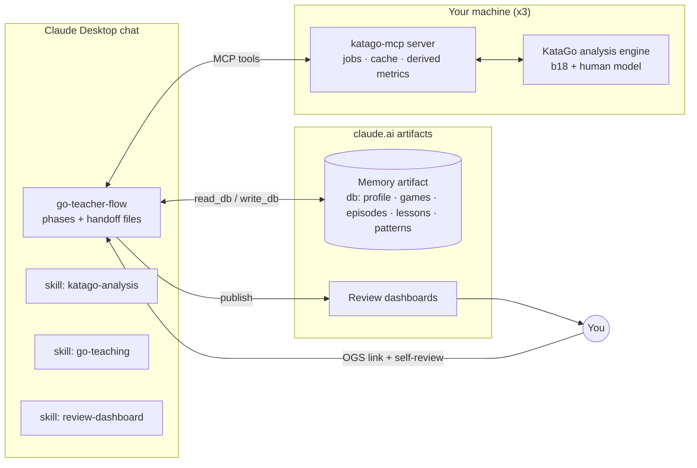

# Go Teacher — Build Plan

**Status:** built through WS7; WS8 in progress, WS9 not started (§3). The details live where they are
used: the tool contract in `skills/go-teacher-flow/references/tool-contract.md`, the teaching method in
`skills/go-teaching`, the tool recipes in `skills/katago-analysis`, the review phases in
`skills/go-teacher-flow`, the memory schema in `skills/go-teacher-flow/references/memory.md`. This file
keeps the goal, the workstreams' acceptance bars, status, decisions and risks.
**Effort sizes:** S = an evening · M = a weekend · L = one to two weeks part-time · XL = more than that.

---

## 0. Goal, scope, principles

### Goal
A Claude project that reviews your OGS games the way a strong, patient teacher would: KataGo is the source of truth, every claim is verified before it is taught, each game yields two or three prioritized lessons delivered through an interactive dashboard, and a memory of recurring weaknesses makes the lessons increasingly personal.

### In scope (v1)
- 19×19 games from OGS, Japanese rules, even and handicap, either color. You are `cwhay888`, currently 6–7k.
- Three machines: Windows + AMD 5700XT, M2 MacBook Air, M5 MacBook Pro.
- Asynchronous first pass running during a blind self-review.
- One published dashboard per review; a cloud database of past reviews shared across machines; initial seeding from 20 past games, half of them handicap.

### Out of scope (v1)
- Progress tracking over time (you do this elsewhere).
- Live analysis while playing; a playing bot.
- 9×9 and 13×13 (cheap later: KataGo supports them; the renderer needs a size parameter).
- Opponent analysis beyond what is needed to detect missed punishments and to explain the result honestly.

### Principles every workstream serves
1. **Engine as the only source of truth.** Claude interprets, prioritizes and teaches; it never asserts a Go fact it has not verified with a tool call.
2. **Rigor is fixed; breadth flexes.** On a slower machine, verify fewer moments, never less carefully.
3. **Blind self-review.** Questions are generated from the SGF alone; engine results stay sealed until your answers are written down.
4. **Two or three lessons per game.** When memory has an active theme, one lesson continues it.
5. **Engine-validated dashboard.** No sequence appears in the dashboard unless the server has legality-checked and evaluated it.
6. **Points, not percentages.** Score lead is the unit for everything; winrate only answers "how decided is the game."
7. **Simplest sufficient move.** Recommend the move with the highest target-rank (3k) human probability among moves within about a point of the engine's best.
8. **Server computes, Claude narrates.** Derived facts (chains, tags, decisive moment, group status, beliefs, end comparisons) are computed deterministically in the server so they are consistent across reviews and machines and cannot be confabulated.
9. **You set the clock.** Every review begins by asking how much total time it may take (unless the request already says), from "20 minutes" to "as long as it needs". The server turns that into a concrete allocation for the current machine. Rigor per verified episode never drops below the floor; when time is short, fewer episodes are verified, and the review says so before it starts.
10. **Mechanism, not grades.** A mistake is a move that only makes sense if some belief about the position is true; a lesson recovers the belief, refutes it with a verified sequence, and shows what differs at the end of the better line. A score delta is the size of a lesson, never its reason.

---

## 1. Components

| # | Component | Where it runs | Form | Size |
|---|---|---|---|---|
| C1 | KataGo + networks | each machine | binary, two networks, per-machine config | M |
| C2 | `katago-mcp` server | each machine | Python MCP server | XL |
| C3 | Skill `katago-analysis` | Claude (user skill) | SKILL.md | M |
| C4 | Skill `go-teaching` | Claude (user skill) | SKILL.md | M |
| C5 | Skill `review-dashboard` | Claude (user skill) | SKILL.md + HTML template + build script | L |
| C6 | Review flow | Claude project instructions, or the `go-teacher-flow` skill in a plain Claude Desktop chat | phases + handoff files | M |
| C7 | Memory artifact | claude.ai (published page with `db`) | artifact + schema | M |
| C8 | Review dashboards | claude.ai (published pages) | generated per review | part of C5 |
| C9 | Seed corpus + calibration | one-time | SGFs, batch script, your corrections | M |



The phases of one review, with their handoff files, are in `skills/go-teacher-flow/SKILL.md`.

**Repository layout** (as built)
```
Go-Teacher/
  katago-mcp/          katago_mcp/ (the server), config/{analysis.cfg,m5pro,r5700xt,m2air}.toml,
                       install/, scripts/, tests/
  skills/
    katago-analysis/   SKILL.md
    go-teaching/       SKILL.md
    review-dashboard/  SKILL.md, template/dashboard.html, scripts/build_dashboard.py
    go-teacher-flow/   SKILL.md, references/{memory.md, tool-contract.md}
  docs/                plan.md, archive/ (finished plans)
  seed/                local only (not in git): seed SGFs, seed_summary.{json,md}, calibration.md
```

---

## 2. Workstreams

### WS1 — Engine setup on three machines (C1) — Size M
A working `katago analysis` process on each machine with correct rules handling and a recorded, sustained
throughput. Install and benchmark steps: `katago-mcp/README.md` §2.

**Acceptance**
- A JSON query to `katago analysis` returns on all three machines.
- Visits/s recorded per machine (cold and sustained).
- Result reconciliation passes on 3/3 counted games (even and handicap).

**Dependencies:** none.

### WS2 — `katago-mcp` server (C2) — Size XL
The one component that touches the engine: a teaching-oriented tool surface, asynchronous survey jobs,
budget conversion, caching, deterministic derived facts, and validation of everything that reaches the
dashboard. Python with the official MCP SDK; its own SGF parser and board; `unittest` suite against a
mock engine. Tools, inputs, outputs, derived metrics and the budget algorithm:
`skills/go-teacher-flow/references/tool-contract.md`.

**Acceptance**
- All tools callable from the Claude desktop app on the Pro; with a 30-minute budget, a 250-move survey finishes within `survey_minutes_target` (10 min) on the Pro.
- `plan_budget` returns sensible allocations for 15, 30 and 60 minutes and for `unlimited` on all three machines, and the minimum full-rigor time on each.
- On a game you know well, the digest's top three episodes match your own view of the biggest mistakes at least two of three times (a sanity check, not precision).
- `validate_variations` rejects an illegal or misordered branch.
- Golden tests pass; logs and `analysis.json` written.

**Dependencies:** WS1.

### WS3 — Skill `katago-analysis` (C3) — Size M
How to use the tools and read their output: budget steps, the survey digest, the belief protocol, the
proof tree, stability, the ledger. See `skills/katago-analysis/SKILL.md`; budget numbers are in the
contract §1.2.

**Acceptance.** A dry run in which Claude, given a survey digest and no other help, produces ledger entries whose queries and verdicts you judge correct on three of three episodes.

**Dependencies:** WS2 tool contract.

### WS4 — Skill `go-teaching` (C4) — Size M
The pedagogy: beliefs and the 15-category taxonomy, triage, the lesson template, the blind self-review
and the episode interview, memory use, conduct. See `skills/go-teaching/SKILL.md`.

**Acceptance.** A sample lesson written from a real ledger passes a checklist: every claim traceable, one `rule_check`, one cue, one exercise, numbers policy respected, no uncashed concept words.

**Dependencies:** WS3 (ledger format).

### WS5 — Skill `review-dashboard` + build script (C5, C8) — Size L
A fixed, tested HTML template that renders any review from a JSON data file, so Claude produces data,
never code. `validate_variations` assembles the blob (contract §1.17, §5); `build_dashboard.py` checks
its SHA-256. See `skills/review-dashboard/SKILL.md`. Deferred to v1.1: live click evaluation via the
artifact `mcp` capability, an "ask the teacher" panel, SGF export.

**Acceptance.** A dashboard built from the test data works on desktop and phone; a dashboard built from a real review contains zero hand-written HTML.

**Dependencies:** WS2 (`validate_variations`).

### WS6 — Memory artifact (C7) — Size M
Cross-game recurrence of categories and beliefs, shared across all three machines, in the "Go teacher
memory" artifact's `db`. Collections, the read in Phase 0 and the write recipe:
`skills/go-teacher-flow/references/memory.md`.

**Acceptance.** Two consecutive reviews where the second one's triage visibly uses the first one's episodes (recurrence multiplier applied; active theme followed up).

**Dependencies:** WS4 (taxonomy and beliefs).

### WS7 — Review flow and handoff documents (C6) — Size M
The orchestrator: phase order, handoff files, what to do when things go wrong. See
`skills/go-teacher-flow/SKILL.md` (it also serves plain Claude Desktop chats, the only chats that reach
the local server).

**Acceptance.** One full review on the Pro where every handoff document exists and each lesson claim traces to a ledger entry and a logged query.

**Dependencies:** WS3, WS4, WS5, WS6.

### WS8 — Seeding and calibration (C9) — Size M
Survey 20 recent OGS games (10 even, 10 handicap, both colors, giving and receiving stones) with
`katago-mcp-seed` (`katago-mcp/README.md` §5b), draft tags, beliefs and a profile, take your correction
pass, calibrate the `[thresholds]`, seed memory. The procedure is in `skills/go-teacher-flow`
("Calibration / seeding pass").

**Acceptance**
- A profile you agree with; tag accuracy you rate ≥ 80 % on a 20-episode sample.
- Causal lessons, on a fixed test set of ~8 episodes from reviews on disk (ogs_91122267 moves 44–50 and 100–103, ogs_90613406 moves 166–176, others; the lesson text before v0.3 is the "before"): every "why" sentence cites a verified sequence or an end comparison; no uncashed concept words; inferred beliefs match yours on ≥ 6 of 8; you prefer the new lessons blind.

**Dependencies:** WS2, WS4, WS6.

### WS9 — Integration, hardening, remaining machines — Size M
End-to-end reviews on three games (even as Black, even as White, handicap); the server on the 5700XT and
the Air; a 10-item review-quality rubric for the first 5–10 reviews; failure drills (engine down
mid-job, Air timeout with partial results, SGF with passes and a resign, wrong komi); versions recorded
so you know which skills and server produced which review.

**Acceptance.** Three reviews score ≥ 8/10 on the rubric; all three machines work, and on the Air `plan_budget` reports the three-episode minimum correctly.

---

## 3. Status, 1 Oct 2026

katago-mcp **0.4.2**, **25 tools**, tool contract **v0.5.2** (causal evidence: belief probes, forced
lines, end comparisons, archived in `docs/archive/plan-causal-lessons.md`; v0.4 runs the verification
in the background during the episode interviews; v0.5 opens the review page in Phase 0 and grows it
with the review).

| Workstream | State | Notes |
|---|---|---|
| WS1 engine setup | **working on the Pro** (Metal) | install scripts and `selfcheck` delivered; the 5700XT and the Air are not yet confirmed |
| WS2 katago-mcp server | running, 0.4.2 | 25 tools; runs against live KataGo on the Pro; offline test suite with the mock engine; the background verification (0.3.0) is tested on the mock engine only |
| WS3 katago-analysis skill | delivered | belief protocol and proof tree |
| WS4 go-teaching skill | delivered | beliefs, lesson template, concept-word rule, blind review + interview |
| WS5 review-dashboard | delivered | branches off branches, end comparison panel, `rule_check`; follow-up questions as their own episodes (0.2.2); live from Phase 0 with boards and clicked answers (0.4.0), tested in headless Chrome with a stand-in database, not yet on claude.ai |
| WS6 memory artifact | delivered | "Go teacher memory" artifact with `db`; the read-only page does not show `beliefs` / `belief_insight` yet |
| WS7 review flow | delivered | project instructions plus the `go-teacher-flow` skill |
| WS8 seeding (20 games) | **in progress** | 20 games surveyed at 500 visits/move; calibration draft (`seed/calibration.md`, local) awaits the correction pass; belief thresholds not yet tuned on the seed games (`katago-mcp-seed --probes`); the causal-lesson calibration on the fixed test set with your ratings (WS8 acceptance) not yet run |
| WS9 integration | not started | |

---

## 4. Decisions

| # | Decision | Choice |
|---|---|---|
| 1 | Server stack | Python |
| 2 | Topology | one server per machine; no remote mode in v1 |
| 3 | Networks | b18 + human model, identical on all machines |
| 4 | Memory | artifact `db` |
| 5 | Counts | 3–5 episodes verified, 2–3 lessons per review |
| 6 | Self-review (29 Sep, replaces "5–8 questions, ~10 minutes") | four mandatory blind questions (~5 min, go-teaching §4.1); the freed time goes to one interview question per selected episode after triage (~5 min, §4.2) |
| 7 | Dashboard | v1 template; live evaluation, ask-the-teacher and SGF export deferred to v1.1 |
| 8 | `local_solve` | v1 |
| 9 | Resigned games | analysis stops at the resign point |
| 10 | Seed corpus | 20 games, 50% handicap |
| 11 | Review time budget | asked at the start of every review unless the request states it; allocation computed by `plan_budget` (Principle 9) |
| 12 | Budget under the causal unit (29 Sep) | rigor per episode is fixed; at short review times fewer episodes are verified (2 instead of 3); visits per node are not lowered to keep the count |
| 13 | Taxonomy (29 Sep) | the 15 categories stay as labels so memory stays continuous; `belief` is added alongside them |
| 14 | Interviews and engine overlap (1 Oct) | a tool call blocks Claude's turn, so the answer-free probes run in a server-side background queue during the interviews (`start_verification`); the server seals each episode until `record_interview`; a planned survey precomputes its top 4 episodes; the planner counts the overlap and budgets one student line per episode |
| 15 | Review page from the start (1 Oct) | the dashboard is published live in Phase 0 with the `db` capability and grows with the review: boards (positions, lines, questions) replace ASCII diagrams in chat, and the student answers moves by clicking on the board; rows come from `dashboard_row` with a SHA-256 the page checks; no engine data on the page before the lessons; Phase 6 rebuilds it in place; `render_board` in chat is the fallback |

---

## 5. Risks and mitigations

| Risk | Mitigation |
|---|---|
| Claude rationalizes engine numbers into wrong Go explanations | ledger with predictions; server-computed derived facts and beliefs; end comparisons instead of deltas; engine-validated branches only |
| Winrate misleads, especially in handicap games | points everywhere; winrate only for "how decided" |
| The Air is too slow for the pipeline | `plan_budget` states the minimum full-rigor time up front; fewer episodes; `analysis.json` reusable across machines |
| Taxonomy drift across reviews | rule-based candidate tags in the server; Claude picks only among candidates |
| Memory bloat or stale profile | compact profile with recency weighting; full history kept only in `episodes` |
| Hand-built dashboards break | fixed template + checksummed data + build script |
| KataGo's Japanese-rules approximations (seki, bent four) | reconciliation check; never teach rules edge cases from engine output |
| Human-model probabilities misread as "correct" | human layers inform learnability and punishability only; correctness always comes from search |
| Context bloat from raw engine JSON | digest by default; full detail on request; position refs instead of move lists |
| Product features change (skills, MCP in the desktop app, artifact capabilities) | verify at each milestone against support.claude.com; the server and template are product-independent |

---

## 6. What "done" looks like

You give an OGS link on any of your three machines and say how long the review may take. Within a minute you are answering questions about the game; when the time is up you receive a dashboard link. Every lesson in it says what you were trying to do, where your reading broke, and what is different at the end of the better line, on sequences the engine actually played out; the recommended move is one a 3k would find, the quiz lets you test yourself on the key positions, and one lesson picks up where the last review left off. Nothing in the review was written from a hunch.
