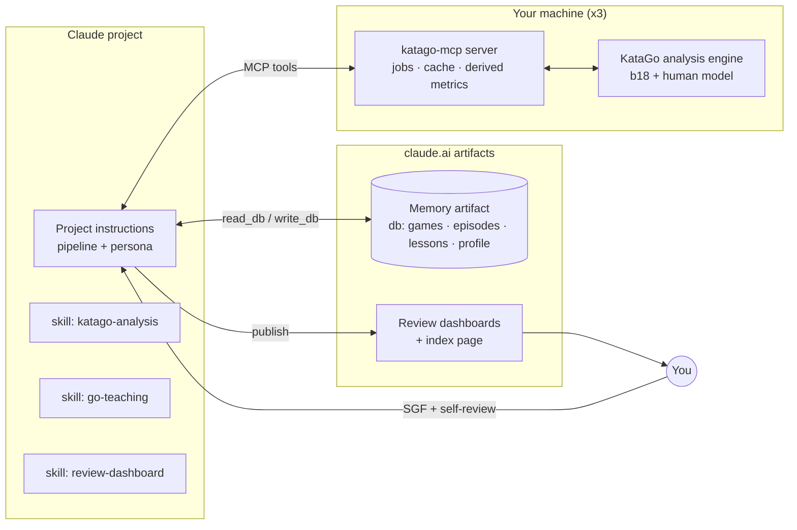
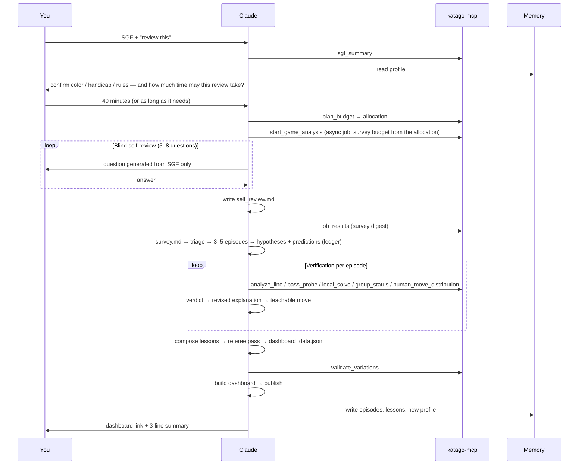

# Go Teacher — Build Plan (v0.3)

**Status:** decisions made (Section 4); ready to build from WS1. v0.2: decisions folded in; review time budget added (Principle 9, `plan_budget`, Phase 0). v0.3: two refinements from the tool contract — the self-review minutes count inside the time budget, and `validate_variations` exports the checksummed dashboard data.
**Effort sizes:** S = an evening · M = a weekend · L = one to two weeks part-time · XL = more than that.

---

## 0. Goal, scope, principles

### Goal
A Claude project that reviews your OGS games the way a strong, patient teacher would: KataGo is the source of truth, every claim is verified before it is taught, each game yields two or three prioritized lessons delivered through an interactive dashboard, and a memory of recurring weaknesses makes the lessons increasingly personal.

### In scope (v1)
- 19×19 games from OGS, Japanese rules, even and handicap, either color. You are `cwhay888`, currently 6–7k.
- Three machines: Windows + AMD 5700XT, M2 MacBook Air, M5 MacBook Pro.
- Asynchronous first pass running during a blind self-review.
- One published dashboard per review; a cloud database of past reviews shared across machines; initial seeding from 20 past games, half of them handicap.

### Out of scope (v1)
- Progress tracking over time (you do this elsewhere).
- Live analysis while playing; a playing bot.
- 9×9 and 13×13 (cheap later: KataGo supports them; the renderer needs a size parameter).
- Opponent analysis beyond what is needed to detect missed punishments and to explain the result honestly.

### Principles every workstream serves
1. **Engine as the only source of truth.** Claude interprets, prioritizes and teaches; it never asserts a Go fact it has not verified with a tool call.
2. **Rigor is fixed; breadth flexes.** On a slower machine, verify fewer moments, never less carefully.
3. **Blind self-review.** Questions are generated from the SGF alone; engine results stay sealed until your answers are written down.
4. **Two or three lessons per game.** When memory has an active theme, one lesson continues it.
5. **Engine-validated dashboard.** No sequence appears in the dashboard unless the server has legality-checked and evaluated it.
6. **Points, not percentages.** Score lead is the unit for everything; winrate only answers "how decided is the game."
7. **Simplest sufficient move.** Recommend the move with the highest target-rank (3k) human probability among moves within about a point of the engine's best.
8. **Server computes, Claude narrates.** Derived facts (chains, tags, decisive moment, group status) are computed deterministically in the server so they are consistent across reviews and machines and cannot be confabulated.
9. **You set the clock.** Every review begins by asking how much total time it may take (unless the request already says), from "20 minutes" to "as long as it needs". The server turns that into a concrete allocation for the current machine. Rigor per verified episode never drops below the floor; when time is short, fewer episodes are verified, and the review says so before it starts.

---

## 1. System overview

### Components

| # | Component | Where it runs | Form | Size |
|---|---|---|---|---|
| C1 | KataGo + networks | each machine | binary, two networks, per-machine config | M |
| C2 | `katago-mcp` server | each machine | Python MCP server | XL |
| C3 | Skill `katago-analysis` | Claude (user skill) | SKILL.md + references | M |
| C4 | Skill `go-teaching` | Claude (user skill) | SKILL.md + references | M |
| C5 | Skill `review-dashboard` | Claude (user skill) | SKILL.md + HTML template + build script + JSON schema | L |
| C6 | Project instructions | the Claude project | prompt + handoff templates | M |
| C7 | Memory artifact | claude.ai (published page with `db`) | artifact + schema | M |
| C8 | Review dashboards + index | claude.ai (published pages) | generated per review | part of C5 |
| C9 | Seed corpus + calibration | one-time | SGFs, batch script, your corrections | M |

### Architecture



### One review, end to end



---

## 2. Workstreams

### WS1 — Engine setup on three machines (C1) — Size M

**Purpose.** A working `katago analysis` process on each machine with correct rules handling and a recorded, sustained throughput.

**Tasks**
1. Install KataGo per platform: Windows OpenCL build for the 5700XT (no CUDA/TensorRT on AMD); Apple Silicon builds on both Macs, preferring the Metal backend if the release or Homebrew build offers it, otherwise OpenCL. Check the KataGo README for the currently recommended macOS backend.
2. Networks (decided: b18 everywhere): latest `b18c384nbt` from katagotraining.org and the human-like model (`b18c384nbt-humanv0`), identical on all three machines so evaluations stay comparable across them.
3. Per-machine analysis config: `numAnalysisThreads`, `numSearchThreadsPerAnalysisThread`, `nnMaxBatchSize`, `nnCacheSizePowerOfTwo`, `analysisPVLen` (≥ 12 so principal variations are long enough to follow), `reportAnalysisWinratesAs = BLACK`. Run the OpenCL tuner once on the 5700XT and keep the tuner cache.
4. Benchmark each machine (`katago benchmark` plus a timed 300-visit query on a middlegame position); record visits/s in the machine's config so the server can convert seconds to visits.
5. Rules validation: Japanese rules, komi read from the SGF `KM` property (never assumed), handicap stones passed as `initialStones`, no white handicap bonus (Japanese). Run **result reconciliation** on three counted games: the engine's score at the final position must be within ~2 points of the SGF result.
6. Thermal check on the Air: 10 minutes of sustained analysis; record the throttled throughput and set the Air's budgets from that number, not the cold one.

**Acceptance**
- A JSON query to `katago analysis` returns on all three machines.
- Visits/s recorded per machine (cold and sustained).
- Result reconciliation passes on 3/3 counted games (even and handicap).

**Dependencies:** none.

---

### WS2 — `katago-mcp` server (C2) — Size XL

**Purpose.** The one component that touches the engine. It exposes a small, teaching-oriented tool surface, runs jobs asynchronously, converts budgets, caches, computes derived facts, and validates everything that will reach the dashboard.

**Stack (decided).** Python with the official MCP SDK, `sgfmill` for SGF parsing and board logic, `numpy` for ownership maps, `pytest`. *As built:* the server has its own SGF parser and board (`katago_mcp/sgf.py`, `board.py`) instead of `sgfmill`, numpy is only used by the mock engine, and the tests are `unittest` (pytest also runs them). One stdio MCP server per machine, used from the Claude desktop app or Claude Code. No remote mode in v1; the transport layer should not preclude adding one later. `local_solve` ships in v1.

**Tool contract (v1)**

| Tool | Inputs | Returns | Serves |
|---|---|---|---|
| `engine_info` | — | machine name, backend, networks, sustained visits/s | budgets |
| `plan_budget` | move count, total review minutes (or `unlimited`), self-review minutes (default 10) | the allocation: survey visits per move and expected survey duration; episodes to verify; per-query budgets (root, forced-line node, stability reruns, local solve); reserve; and the minimum minutes for a full-rigor review on this machine | Principle 9 |
| `sgf_summary` | sgf | players, your color, ranks, handicap, komi, rules, result, resign point, move count, capture events (move, size), rough phase boundaries, ASCII boards at ~moves 50/100/150 and end | blind self-review questions |
| `start_game_analysis` | sgf, budget (seconds or visits), options | job_id, ETA | async survey |
| `job_status` | job_id | moves done/total, ETA, per-move visits so far | pacing the self-review |
| `job_results` | job_id, detail level | **survey digest** (below); full per-move table on request | survey |
| `get_position_ref` | job_id, move number | stable node reference (position hash) usable by other tools | avoids re-sending move lists |
| `analyze_position` | position (moves or ref), budget, options: wide root noise, human profiles, ownership, ownership stdev | candidates (move, prior, visits, winrate, score lead, score stdev, lcb, pv, human probability per profile), ownership, group statuses | hypotheses, teachable move |
| `analyze_line` | position, forced moves [{player, moves, until_depth}], budget, follow-PV plies | the line as played, evaluation at each node, final ownership + group statuses, points lost vs. best | three-line contrast; plan tests |
| `pass_probe` | position, player, budget | score after a forced pass vs. after the actual/best move → local value; urgency ranking of regions | urgent vs. big |
| `swing_value` | position, point, budget | Black-first vs. White-first score, swing, sente/gote classification (does the best reply stay local?) | endgame counting |
| `local_solve` | position, region, budget | attacker-first and defender-first results → alive / dead / unsettled, with caveat flags (outside liberties, ko) | life and death |
| `group_status` | position | per group: stones, liberties, mean ownership, label, region | spatial facts |
| `ownership_diff` | position A, position B | regional deltas, share of the score delta explained, groups with the largest change | ownership attribution |
| `human_move_distribution` | position, profile (`rank_7k` / `rank_3k` / `rank_1d` / opponent's rank) | top human moves with probabilities; probability of specified moves | learnability, punishability |
| `render_board` | position, options: mark last move, overlay ownership, region box | ASCII board in GTP coordinates, liberties of marked groups | coordinate discipline |
| `validate_variations` | episodes with branches, quiz specs and lesson text | legality per branch, evaluations filled in, errors listed; on success the complete dashboard data blob with a SHA-256 checksum | engine-validated dashboard |

**Survey digest** (default `job_results` output; target ≤ 4k tokens)
- Game facts: your color, handicap, rules check (reconciliation status), phase boundaries by ownership settledness, game type (single blunder vs. accumulation), decisive move, last-chance move.
- Both players' average points lost per phase (needed to explain a win or loss honestly).
- **Episodes** (clustered mistakes), ranked by points lost: id, move range, region, root move, points lost, size of the acceptable-set violation, rule-based tags from the search signature, style axis (overplay / slack / neutral), got-away-with-it flag, human-layer probabilities of your move and of the top alternatives (7k / 3k / 1d / opponent's rank), stability flag at the survey's visit count.
- **Positive moments:** your correct moves where the 7k human probability was low.

**Derived metrics implemented in the server (deterministic)**
- Points lost per move (score lead before vs. after, best-reply basis).
- Acceptable set (moves within a margin of best; default 1.0 pt, tunable).
- Episode clustering (same region within N moves; default N = 6).
- Decisive moment and last chance (from the score series and a "recoverable" threshold).
- Got-away-with-it (your loss followed within two moves by the opponent's restoring loss).
- Search-signature tags (policy vs. search; local vs. global via ownership attribution; urgency via pass probe at the top episodes).
- Style axis (own-group vs. opponent-group status deltas after the correct move).
- Phase from ownership settledness.
- Group status labels (defaults: alive ≥ +0.6 own, dead ≤ −0.6, unsettled between; tunable).
- Pattern hash (canonical 7×7 patch around the root move, symmetry-normalized) for recurrence detection.

**Time-budget allocation policy (`plan_budget`)**
- Inputs: the game's move count; the total review time you gave, or `unlimited`; the machine's sustained visits/s; the expected self-review length (default 10 minutes).
- Overhead and the self-review are reserved first: about 4 minutes of fixed overhead for Claude's reasoning, lesson composition, dashboard build and memory writes (a constant, tuned after the first reviews), plus the self-review minutes, which are part of the total you give.
- Survey: sized to finish as the self-review ends, clamped between a floor of 100 visits per move and a cap of 500. If the floor cannot be reached within the self-review on this machine, the survey runs on and the extra minutes are charged to the budget.
- Verification: the remaining engine time is divided into rigor units. One unit = root analysis at the key node + three forced lines (what you played, the teachable alternative, your proposed fix) + one 4× stability rerun; a life-and-death episode adds a local solve. The number of episodes verified is the number of whole units that fit, at most 5. The unit itself never shrinks.
- Fewer than three units fit: the tool returns the minimum minutes for a three-episode review on this machine, and Claude asks whether to extend the budget or accept fewer episodes.
- `unlimited`: survey at 500 visits per move; five episodes; 4× and 16× stability reruns; a local solve on every life-and-death episode; principal variations followed to 12 plies.
- Surplus time after the maximum of five episodes goes to depth upgrades in a fixed order (root visits, forced-line visits, the 16× stability rerun, longer principal variations, deeper local solves), never to more episodes; the exact ladder is in the tool contract.
- The allocation is advisory. You can extend the budget mid-review ("spend more time on E3"), and Claude reports the engine time actually used at the end.

**Non-functional requirements**
- Budget-aware: every tool accepts seconds or visits; the server converts using the sustained visits/s, and `plan_budget` is the one place the conversion policy lives.
- Stability-based stopping for verification queries: analyze in increments (`reportDuringSearchEvery`), stop when the top move and score lead have held across the last increments, or at the cap.
- Position cache keyed by position hash + visits. Each job's full results saved to `reviews/<game_id>/analysis.json` so any machine can reload them.
- Every query and response appended to `reviews/<game_id>/queries.jsonl` — the raw evidence behind the ledger.
- Coordinate normalization at the boundary: SGF letters in, GTP coordinates ("D4", no "I") out. Claude never sees SGF coordinates.
- Clear, actionable errors ("engine not running", "job timed out at move 143; partial results available").
- Concurrency: one job at a time per machine; verification queries may run during a job at lower priority (KataGo's query `priority` field).

**Testing**
- Unit: coordinate conversion; SGF parsing including OGS quirks (`AB` handicap placement, passes, resign results); groups and liberties; episode clustering; pattern-hash symmetry.
- Integration: golden tests on three fixed SGFs with stored engine outputs (mocked engine), so derived metrics are reproducible without a GPU.
- Live smoke test per machine: a 40-move game end to end at low budget.

**Acceptance**
- All tools callable from the Claude desktop app on the Pro; with a 30-minute budget, a 250-move survey finishes inside the 10-minute self-review on the Pro.
- `plan_budget` returns sensible allocations for 15, 30 and 60 minutes and for `unlimited` on all three machines, and the minimum full-rigor time on each.
- On a game you know well, the digest's top three episodes match your own view of the biggest mistakes at least two of three times (a sanity check, not precision).
- `validate_variations` rejects an illegal or misordered branch.
- Golden tests pass; logs and `analysis.json` written.

**Dependencies:** WS1.
**Open items:** default thresholds (set in WS8); the overhead constant in `plan_budget` (tuned after the first reviews).

---

### WS3 — Skill `katago-analysis` (C3) — Size M

**Purpose.** Teach Claude to use the server well and to read engine output correctly. Procedures, not code.

**SKILL.md contents**
1. When to call which tool; the position-ref pattern (never resend long move lists).
2. How to read a `plan_budget` allocation and stay inside it, with the rule "fewer episodes, same rigor"; the reference table below shows what typical budgets buy on each machine.
3. Interpretation rules: points not winrate; the acceptable set; stability; score stdev as risk; lcb vs. winrate as uncertainty; what the three human-profile layers mean and how they are used; handicap adjustments.
4. Verification recipes, one per mechanic, each a numbered procedure: the tool calls, what the output must show for CONFIRMED, and typical ways the check can lie (e.g. a local solve ignoring outside liberties).
5. The ledger entry format, and the rule that only CONFIRMED entries may be taught as fact.
6. Prohibitions: reasoning about stones from move lists; quoting SGF coordinates; asserting group status, liberties or life and death without `group_status` or `local_solve`; teaching anything from an INCONCLUSIVE entry.
7. A worked example: one episode from survey → hypothesis → queries → verdict → teachable move.

**`references/`:** KataGo field glossary (`scoreLead`, `scoreStdev`, `lcb`, `prior`, `pv`, ownership sign convention); example outputs of every tool; human-profile naming rules (`rank_7k`, `rank_1d`; clamp OGS ranks outside the model's range).

**Reference table — what a budget buys** (illustrative; the server computes the real numbers from WS1 benchmarks)

| Total review time | M5 Pro | 5700XT | M2 Air (sustained) |
|---|---|---|---|
| 20 min | survey ~300 visits/move · 3 episodes · 4× stability | survey ~200 · 3 episodes · 4× | below the three-episode minimum → asks to extend or accept two |
| 40 min | survey ~400 · 5 episodes · 4× | survey ~300 · 4 episodes · 4× | survey ~150 · 3 episodes · 4× |
| unlimited | survey 500 · 5 episodes · 4× and 16× · local solves · 12-ply PVs | same, slower | same, much slower |

Rigor floors (never reduced by the budget): root analysis at a key node ≥ 1,000 visits; forced-line nodes ≥ 250 visits; one 4× stability rerun per episode.

**Ledger entry format**
```
E3 · moves 87–91 · Black (you)
Hypothesis: the hane at Q7 leaves a cutting point; after the cut the right-side group
            cannot connect and dies.
Prediction: forcing the cut at R7, mean ownership of the right group drops below −0.5 and
            Black's best local defense fails; the solid connection at Q8 keeps it above +0.7.
Queries:    analyze_line(…), local_solve(…), group_status(…)
Result:     …
Verdict:    CONFIRMED | REFUTED | INCONCLUSIVE — revised explanation: …
Teachable:  Q8 (rank_3k p = 0.31; within 0.8 pts of best) · depth 4 moves (under cap)
```

**Acceptance.** A dry run in which Claude, given a survey digest and no other help, produces ledger entries whose queries and verdicts you judge correct on three of three episodes.

**Dependencies:** WS2 tool contract frozen (the skill quotes it).

---

### WS4 — Skill `go-teaching` (C4) — Size M

**Purpose.** The pedagogy: taxonomy, triage, lesson format, level calibration, self-review questions, voice.

**1. Mistake taxonomy** — review this list carefully; it is the backbone of the memory.

| # | Category | Typical engine signature |
|---|---|---|
| 1 | Direction of play / whole-board choice | small local loss, large global loss |
| 2 | Urgent vs. big (tenuki timing) | pass probe shows high urgency you ignored |
| 3 | Life and death — own group's status misjudged | policy prefers your move, search refutes; own status collapses |
| 4 | Life and death — attack (missed kill, wrong attacking move) | opponent's group status improves after your move |
| 5 | Tactical reading (cuts, ladders, nets, races, snapbacks) | search refutes a plausible move within a short line |
| 6 | Shape and connection | policy prefers the correct move; you didn't play it |
| 7 | Joseki / corner sequence deviation | opening phase, local loss, known pattern |
| 8 | Invasion / reduction judgment | large ownership swing in one region after a deep or shallow choice |
| 9 | Choice of fight (wrong group; fighting when ahead) | high score stdev chosen when a low-stdev move was near-equal |
| 10 | Thickness / aji (leaving or ignoring weaknesses) | ownership stdev high in a region you left |
| 11 | Endgame value (order, missed sente, wrong size) | endgame phase; swing mismatch |
| 12 | Ko (starting, ignoring, threat choice) | ko in position |
| 13 | Failure to punish | opponent's prior mistake, your move gives the gain back |
| 14 | Passive / following the opponent | slack axis; best move was elsewhere |
| 15 | Slow move / overconcentration | acceptable-set violation with low urgency locally |

Orthogonal fields per episode: **style axis** (overplay / slack / neutral — computed), **awareness** from your self-review (knew it was bad → discipline; suspected; thought it was fine → knowledge gap), **game state** (ahead / close / behind at the time).

**2. Rule-based tag assignment.** The server emits candidate categories from the signature table; Claude picks the primary and must cite the ledger entry that justifies it. Claude may not invent a category outside the candidates without stating why.

**3. Triage.** Episode score = points lost (capped; weighted up when the game was close) × learnability (3k probability of the teachable move; below a floor → "beyond horizon", mentioned but not taught) × recurrence (1 + recency-weighted count of the same category or pattern hash in memory) × a bonus for blind spots (engine flagged, you didn't). Select 3–5 for verification, 2–3 for teaching; force-include one from the active curriculum if a qualifying episode exists.

**4. Lesson format.** (a) What happened, one paragraph with points lost. (b) The verified lines (dashboard branches). (c) The principle in one sentence. (d) The recognition cue for next time, derived from the position's features. (e) The exercise (quiz reference). (f) Memory link ("third time this category has appeared"), if any. Each review also contains one **strength** (a difficult correct move) and a 3–4 sentence honest **game narrative** (why you won or lost, including the opponent's errors).

**5. Level calibration for 6–7k.** Introduce a term once, then use it. Depth cap ~6 moves: beyond that, teach the heuristic and attach the line. Teachable-move rule (principle 7). Numbers policy: rounded points; no winrates except "the game was decided here." Handicap framing — giving: separate "objectively an overplay" from "practically sound against a 10k" using punishability; receiving: lead management and unnecessary fights.

**6. Self-review protocol.** Questions only from `sgf_summary`; adaptive follow-ups; cap ~8 questions; mandatory "what would you have played instead?" for any move you flag.

Question bank v1:
- Where do you think the game was decided, and why?
- Which move were you least sure about while playing? What would you play instead now?
- At move ~50 / ~100 / ~150 (board shown): who is ahead, and by roughly how much?
- What was your plan when you played move N? (N chosen from capture events or fight starts)
- Was there a moment you wanted to tenuki and didn't — or did and regretted it?
- Was this opponent stronger, equal or weaker than usual for you?
- One move you're proud of.
- (If an active theme exists) We were working on X. Did it come up? Where?

**7. Teacher voice.** Direct, warm, concrete; no padding; distinguishes "the engine shows" from "I judge"; admits when a moment is hard; does not moralize about time or effort.

**Acceptance.** A sample lesson written from a real ledger passes a checklist: every claim traceable, one principle, one cue, one exercise, numbers policy respected, depth cap respected.

**Dependencies:** WS3 (ledger format).

---

### WS5 — Skill `review-dashboard` + build script (C5, C8) — Size L

**Purpose.** A fixed, tested HTML template that renders any review from a JSON data file, so Claude produces data, never code.

**Template features** — ● v1 · ○ deferred to v1.1 (decided: v1 ships the ● list only)
- ● SVG goban: stones, last-move marker, move-number toggle, coordinates, handicap stones, capture counts.
- ● Navigation: slider, prev/next, first/last, keyboard arrows, click on the score graph, "jump to episode" list.
- ● Score-lead graph (points, your perspective) with episode markers and decisive / last-chance markers.
- ● Commentary panel keyed to move **ranges**; the active episode's text appears as you enter its range.
- ● Branches: verified variations selectable from the commentary, played on the board with per-node evaluation; "back to game" control.
- ● Ownership heatmap toggle at nodes where ownership was stored (episode nodes and branch ends).
- ● Quiz mode per episode: the move is hidden, you click, graded against precomputed candidates plus your actual move and the 7k peer move; a status-judgment quiz for life-and-death episodes.
- ● Summary tab: lessons, strength, game narrative, your self-review answers with the engine's verdict beside each.
- ● Light/dark, phone layout, no external dependencies (plain HTML/CSS/JS).
- ○ Live click evaluation via the artifact `mcp` runtime capability calling the local `katago-mcp` server (Claude desktop app only; falls back to precomputed grading elsewhere).
- ○ "Ask the teacher" panel via the `sample` capability, with the episode's ledger as context.
- ○ SGF export of the game with branches via the `downloads` capability.

**Data schema** (`dashboard.schema.json`, top level — illustrative)
```json
{
  "game": {"id": "", "date": "", "you": "B", "opponent": "", "opponentRank": "10k",
           "handicap": 0, "komi": 6.5, "result": ""},
  "setup": {"AB": [], "AW": []},
  "moves": ["D4", "Q16", "..."],
  "scoreSeries": [0.0, 0.3],
  "episodes": [{
    "id": "E1", "moves": [87, 91], "title": "", "category": "", "tags": [], "pointsLost": 8,
    "commentary": [{"atMove": 87, "text": ""}, {"atMove": 89, "text": ""}],
    "branches": [{"id": "B1", "label": "What you played", "from": 86,
                  "moves": [], "evals": [], "ownershipAtEnd": []}],
    "quiz": {"atMove": 87, "candidates": [{"move": "Q8", "pointsLost": 0, "note": ""}],
             "actual": "Q7", "peerMove": "Q7"},
    "principle": "", "cue": ""
  }],
  "ownership": {"87": [], "B1:end": []},
  "summary": {"lessons": [], "strength": {}, "narrative": "", "selfReview": []}
}
```

**Build.** Numeric data (moves, score series, ownership snapshots, branch evaluations) cannot be retyped by Claude without error, so `validate_variations` does more than check legality: it assembles the complete `data.json` from the server's own records plus the lesson text Claude passes in, and returns it with a SHA-256 checksum. Claude writes that blob verbatim; `scripts/build_dashboard.py data.json → review.html` verifies the checksum, validates the schema and injects the JSON into the template. Workflow: `validate_variations` → write `data.json` → build → publish via the Artifact tool → append the review to the index artifact. Requires code execution enabled in the project; fallback: the server exposes `build_dashboard` and returns the HTML.

**Testing.** A test `data.json` covering handicap, passes, branches and quizzes; render check on desktop and phone; illegal-move rejection; ownership rendering at branch ends.

**Acceptance.** A dashboard built from the test data works on desktop and phone with every ● feature; a dashboard built from a real review contains zero hand-written HTML.

**Dependencies:** WS2 (`validate_variations`; schema agreement).

---

### WS6 — Memory artifact (C7) — Size M

**Purpose.** Cross-game recurrence and the active curriculum, shared across all three machines.

**Storage (decided).** A published page declaring the `db` capability; Claude reads and writes it directly (`read_db` / `write_db`), verified available in this environment. Each review also saves a JSON dump of the database in its bundle, which doubles as the fallback if the artifact is ever unavailable.

**Artifact.** "Go Teacher Memory" page declaring `db` and `user`. It renders the profile and episode list; the owner can edit the profile text (so you can correct it). Claude does the structured writing.

**Collections**

| Collection | Key | Fields |
|---|---|---|
| `games` | `{game_id}` | ogs_id or sgf_hash, date, your color, opponent rank, handicap, komi, result, decisive_move, game_type, avg_points_lost_by_phase (both players), lesson_ids, dashboard_url |
| `episodes` | `{game_id}-{n}` | move_range, region, category_primary, category_secondary, style_axis, phase, points_lost, awareness, game_state, learnability (3k probability of the teachable move), pattern_hash, verdict, taught, ledger_ref |
| `lessons` | `{id}` | game_id, episode_ids, category, principle, cue, delivered_at, landed (unknown / yes / no — set at a later review when the same situation recurs) |
| `patterns` | `{hash}` | count, example_episode_ids, one-line description |
| `profile` | `current` | the compact profile below, `updated_at`, `games_count` |

**Profile document** (≤ 1,500 tokens): identity (rank, usernames, colors played); style balance (overplay vs. slack counts, described in words); top 5 recurring categories with recency-weighted counts and one line of evidence each; top pattern hashes with counts and descriptions; active curriculum (2–3 themes, since which game, lesson ids); strengths; failure conditions (ahead / behind / handicap side / phase); explanation preferences; one-line summaries of the last three reviews.

**Protocol.** Read `profile/current` in Phase 0. In Phase 6 write `games`, `episodes`, `lessons`; update `patterns`; regenerate `profile/current` (recency weight 0.85 per game; a category leaves the top 5 when its weighted count falls below a floor; nothing is deleted from `episodes`).

**Acceptance.** Two consecutive reviews where the second one's triage visibly uses the first one's episodes (recurrence multiplier applied; active theme followed up).

**Dependencies:** WS4 (taxonomy frozen).

---

### WS7 — Project instructions and handoff documents (C6) — Size M

**Purpose.** The orchestrator: persona, phase pipeline, rules of conduct, pointers to the three skills.

**Phases and handoff documents** — each is written before the next phase starts; they make the pipeline auditable.

| Phase | Actions | Handoff |
|---|---|---|
| 0 Intake | `sgf_summary`; read profile; one message that confirms color / handicap / rules **and asks the total time budget** (skipped when the request states it); `plan_budget`; report the allocation in one line; `start_game_analysis` with the survey budget | `intake.md` (facts, time budget, allocation, active theme) |
| 1 Blind self-review | 5–8 questions from the SGF only; adaptive follow-ups; "what instead?" for flagged moves | `self_review.md` (answers, flagged moves with proposed fixes, position estimates) |
| 2 Survey | `job_results` (only now); reconcile with self-review (agreement / false alarm / blind spot) | `survey.md` (ranked episodes, decisive and last-chance moves, game type, disagreements, positives) |
| 3 Select + hypothesize | triage; pick 3–5 episodes; hypothesis + prediction per episode | `ledger.md` (open entries) |
| 4 Verify | run recipes; verdicts; revise; teachable move; depth check | `ledger.md` (closed), `verified.md` |
| 5 Teach | compose 2–3 lessons + strength + narrative; referee pass; `dashboard_data.json`; `validate_variations`; build; publish | dashboard URL, `lesson.md` |
| 6 Remember | write memory records; regenerate profile; tell you what was stored in three lines | memory writes |

**Rules of conduct** (the non-negotiables, written as instructions): results stay sealed until `self_review.md` exists · no Go fact without a ledger entry · GTP coordinates only · points, not winrates · stay inside the time budget and its allocation, asking before exceeding it · fewer episodes rather than shallower verification · referee pass before publishing · if the engine is unavailable, offer to load a saved `analysis.json` or postpone, never teach without it · one line of progress per phase so the conversation stays readable.

**Special cases covered:** resigned games (analysis stops at the resign point; no "play on" branch — decided); malformed or undo-heavy SGFs (report and stop); games the opponent threw away (say so plainly in the narrative); "review just this sequence" requests (skip Phases 1–2; go straight to hypothesis and verification).

**Acceptance.** One full review on the Pro where every handoff document exists and each lesson claim traces to a ledger entry and a logged query.

**Dependencies:** WS3, WS4, WS5, WS6.

---

### WS8 — Seeding and calibration (C9) — Size M

1. Collect 20 recent OGS games (decided): 10 even and 10 handicap, both colors, a spread of results, and among the handicap games both giving and receiving stones.
2. Run survey-only jobs on all of them with a batch script against the server (no Claude needed) → `analysis.json` per game.
3. In a seeding session, Claude reads the digests, assigns tags using the rule table, and drafts a profile. No lessons.
4. **Your correction pass:** read the draft profile and the top ~20 episodes; correct tags and priorities. You know your play — this is where the profile becomes yours rather than the engine's.
5. Calibrate thresholds from the seed data: acceptable-set margin, clustering distance, group-status thresholds, "recoverable" threshold, learnability floor. Record them in the server config.
6. Seed the memory artifact with the corrected episodes and profile.

**Acceptance.** A profile you agree with; tag accuracy you rate ≥ 80% on a 20-episode sample.

**Dependencies:** WS2, WS4, WS6.

---

### WS9 — Integration, hardening, remaining machines — Size M

1. End-to-end reviews on three games: even as Black, even as White, handicap (either side).
2. Set up the server on the 5700XT and the Air; run the same games; confirm that on the Air a 40-minute budget yields three episodes at full rigor and that `plan_budget` reports the minimum correctly.
3. A 10-item review-quality rubric you score for the first 5–10 reviews; iterate on skills and instructions from the scores.
4. Failure drills: engine down mid-job; Air timeout with partial results; SGF with passes and a resign; wrong komi (reconciliation must catch it).
5. Repo hygiene: skills, instructions, server and template versioned in one git repo with a changelog; version numbers recorded in the profile so you know which prompt produced which review.

**Acceptance.** Three reviews score ≥ 8/10 on the rubric; all three machines work.

---

## 3. Build order and milestones

### Status, 28 Sep 2026

| Workstream | State | Notes |
|---|---|---|
| WS1 engine setup | **working on the Pro** (Metal) | install scripts and `selfcheck` delivered; the 5700XT and the Air are not yet confirmed |
| WS2 katago-mcp server | running, v0.1.5 | 17 tools; runs against live KataGo on the Pro; offline test suite with the mock engine |
| WS3 katago-analysis skill | delivered | |
| WS4 go-teaching skill | delivered | |
| WS5 review-dashboard | delivered | template + `build_dashboard.py`; sample published |
| WS6 memory artifact | delivered | "Go teacher memory" artifact with `db`; schema and recipe in `skills/go-teacher-flow/references/memory.md` |
| WS7 project instructions | delivered (v1) | plus the `go-teacher-flow` skill for plain Claude Desktop chats, which can reach the local server |
| WS8 seeding (20 games) | **in progress** | 20 games surveyed at 500 visits/move; calibration draft (`seed/calibration.md`, local) awaits the student's correction pass |
| WS9 integration | not started | |

Contract is at v0.2.1 (deviations folded in).


| Milestone | Delivers | What you can do at that point |
|---|---|---|
| M1 | WS1 on the Pro; WS2 core (`engine_info`, `plan_budget`, `sgf_summary`, `analyze_position`, `render_board`, `group_status`) | ask position questions in chat and get verified answers |
| M2 | WS2 jobs + survey digest; WS3 | survey-level review in chat |
| M3 | WS2 verification tools; WS4; WS7 v1 | fully verified lessons in chat, no dashboard |
| M4 | WS5 | complete review with dashboard — the first "real" review |
| M5 | WS6; WS8 | personalized reviews |
| M6 | WS9 | all three machines; hardened |

Rationale: M1–M3 prove the hard part (engine → verified teaching) before any UI; the dashboard and memory are additive.

**Repository layout** (as built)
```
Go-Teacher/
  katago-mcp/          katago_mcp/ (the server), config/{analysis.cfg,m5pro,r5700xt,m2air}.toml,
                       install/, scripts/, tests/
  skills/
    katago-analysis/   SKILL.md
    go-teaching/       SKILL.md
    review-dashboard/  SKILL.md, template/dashboard.html, scripts/build_dashboard.py
    go-teacher-flow/   SKILL.md, references/{memory.md, tool-contract.md}
  docs/                plan.md, tool-contract.md (identical copy of the skill's)
  seed/                local only (not in git): seed SGFs, seed_summary.{json,md}, calibration.md
```
The taxonomy and question bank live inside `go-teaching/SKILL.md`; the project instructions live in the
Claude project itself; there is no separate schema file or changelog yet.

---

## 4. Decisions made (27 Sep 2026)

| # | Decision | Choice |
|---|---|---|
| 1 | Server stack | Python |
| 2 | Topology | one server per machine; no remote mode in v1 |
| 3 | Networks | b18 + human model, identical on all machines |
| 4 | Memory | artifact `db` |
| 5 | Counts | 3–5 episodes verified, 2–3 lessons per review |
| 6 | Self-review | 5–8 questions, ~10 minutes |
| 7 | Dashboard | v1 ships the ● list; ○ items deferred to v1.1 |
| 8 | `local_solve` | v1 |
| 9 | Resigned games | analysis stops at the resign point |
| 10 | Seed corpus | 20 games, 50% handicap |
| 11 | Review time budget | asked at the start of every review unless the request states it; allocation computed by `plan_budget` (Principle 9) |

---

## 5. Risks and mitigations

| Risk | Mitigation |
|---|---|
| Claude rationalizes engine numbers into wrong Go explanations | ledger with predictions; server-computed derived facts; referee pass; engine-validated branches only |
| Winrate misleads, especially in handicap games | points everywhere; winrate only for "how decided" |
| The Air is too slow for the pipeline | `plan_budget` states the minimum full-rigor time up front; fewer episodes; `analysis.json` reusable across machines |
| Taxonomy drift across reviews | rule-based candidate tags in the server; Claude picks only among candidates |
| Memory bloat or stale profile | compact profile with recency weighting; full history kept only in `episodes` |
| Hand-built dashboards break | fixed template + schema validation + build script |
| KataGo's Japanese-rules approximations (seki, bent four) | reconciliation check; never teach rules edge cases from engine output |
| Human-model probabilities misread as "correct" | human layers inform learnability and punishability only; correctness always comes from search |
| Context bloat from raw engine JSON | digest by default; full detail on request; position refs instead of move lists |
| Product features change (skills, MCP in the desktop app, artifact capabilities) | verify at each milestone against support.claude.com; the server and template are product-independent |

---

## 6. What "done" looks like

You upload an SGF on any of your three machines and say how long the review may take. Within a minute you are answering questions about the game; when the time is up you receive a dashboard link. Every lesson in it points to a sequence the engine actually played out, the recommended move is one a 3k would find, the quiz lets you test yourself on the key positions, and one lesson picks up where the last review left off. Nothing in the review was written from a hunch.
